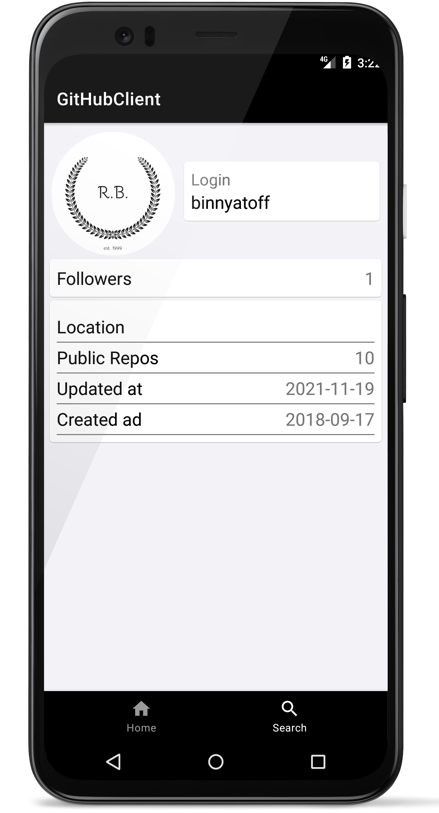

# GitHubClient

GitHubClient, используется API GitHub.

Функционал приложения:
1. Главное меню с пользователями
2. Поиск пользователей по GitHub
3. Список подписчиков и поиск по подписчикам

Использован Hilt, Retrofit2.

| |  | |
|---|---|---|
